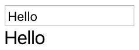

# react-debounce-component
> Debounce any component with React or React Native

```js
<input>
<Debounce ms={500}>
  <List/>
</Debounce>
```

**Tiny**: react-debounce-component is very tiny, fast and does not require any other package. Overall it has under 70 lines of code.

**Generic**: You can debounce almost anything you want: input, search, render, functional components, fetch, api calls, ... It works with react *and* react-native.

**Easy**: [Think In React](https://reactjs.org/docs/thinking-in-react.html) not JS. Most other solution work with functions, but this is a &lt;Component&gt;. It makes the code easier to understand and less error-prone. Just put what you want to debounce inside &lt;Debounce&gt;*here*&lt;/Debounce&gt; of your render function and you're good.


## Install
```sh
npm install react-debounce-component --save
```
or use yarn.


## Examples

### Example 1

This is the most simple example. It just debounces the output of &lt;input&gt; for 1 second.



```js
import React from 'react';
import Debounce from 'react-debounce-component';

class App extends React.Component {
  constructor (props) {
    super(props);
    this.state = {value: 'Hello'}
  }
  render () {
    return (
      <div>
        <input value={this.state.value} onChange={(event) => {this.setState({value: event.target.value})}}/>
        <Debounce ms={1000}>
          <div>{this.state.value}</div>
        </Debounce>
      </div>
    );
  }
}

export default App;
```


## Props

### ms

Time to wait (delay) in milliseconds until the component inside &lt;Debounce&gt; gets rendered.

|          |        |
| -------- | ------ |
| required | no     |
| default  | 250    |
| type     | number |

### initialComponent

What to display on first render (mount). Default is to render the children immediately (e.g. fetch immediately)

Tip: put in null to prevent rendering the children on mount

|          |           |
| -------- | --------- |
| required | no        |
| default  | children  |
| type     | component |


---

Supports React version 16.0.0 and higher. Should even work with 0.13.0 and higher.

---

### License

react-debounce-component is [MIT licensed](./LICENSE).
